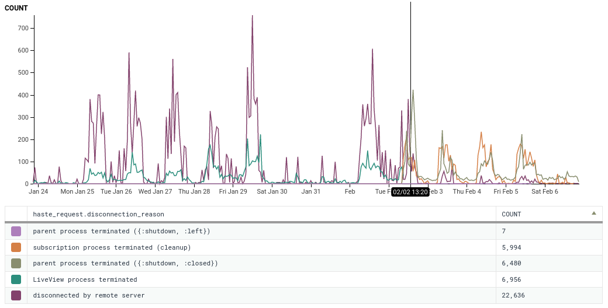

# Why :gun?

Slipstream is built off of [`:gun`](https://hex.pm/packages/gun),
an HTTP and websocket client from the wonderful
[`@ninenines`](https://github.com/ninenines) family of projects.
(Others include [`:cowboy`](https://hex.pm/packages/cowboy) and
[`:ranch`](https://hex.pm/packages/ranch), which power Phoenix.)

`:gun` is battle-tested and fun to use, but the
main feature we wanted gun for is that it is not
[`:websocket_client`](https://hex.pm/packages/websocket_client).

Prior to Slipstream, we at
[`NFIBrokerage`](https://github.com/NFIBrokerage) used
[`phoenix_gen_socket_client`](https://hex.pm/packages/phoenix_gen_socket_client)
and [`phoenix_client`](https://hex.pm/packages/phoenix_client), which are both
backed by [`:websocket_client`](https://hex.pm/packages/websocket_client). Once
we started using phoenix channel clients in our production
services en masse, we found an odd bug we believe to be a [known
issue](https://github.com/sanmiguel/websocket_client/issues/62) in
`:websocket_client` around the RFC-conformance of close frames. This
closing issue would manifest itself as zombie procesess on the server-side
(specifically, `:cowboy_clear.connection_process/4` processes) which would
never release process memory.

This isn't likely a common problem for most phoenix websocket client users, but
at the time we were initially testing out a framework for fueling front-ends
and keeping them up-to-date with a library called Haste, which we intend on
open-sourcing soon. Haste uses websockets rather aggressively, connecting and
disconnecting them very quickly and moving large amounts of data over-the-wire.

In addition to loading pages of data over-the-wire on the websocket connection,
the `Phoenix.Channel` on the server-side would attempt to determine if changes
made in the database would affect rows on a users table. This resulted in a
large numbers of messages being sent to the `Phoenix.Channel`, which prevented
process hibernation, leading to a very large process memory. The stacking up
of this process memory and the zombie-like state these processes were left
in when `:websocket_client` attempted to disconnect would quickly overwhelm
the backend server hosting the data, leading to out-of-memory crashes.

## Post-Cutover Performance

> We cutover to the majority of our phoenix socket clients to Slipstream
> at ~13:29 on 02/02, seen as the black bar in the graph above.
> 
> Note that disconnection reasons such as "LiveView process terminated", all
> "parent process terminated" and "subscription process terminated (cleanup)"
> are benign exit reasons.

Once we cutover our sockets to Slipstream, we found a marked decline in
clients terminating due to remote server disconnect. It's hard to point the
finger at the exact reason this decline took place, but it is likely the
product of a less-encumbered backend.
